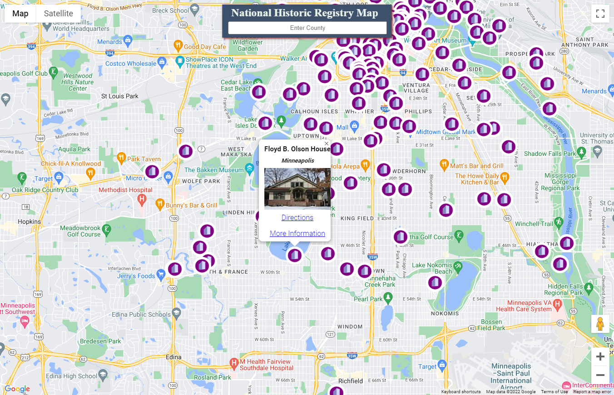

# NHR-MAP

## Summary

Users may search for National Historic Registry sites by county, which renders them as markers on a Google Map. The info windows for the markers include links to their Wikipedia page and directions in Google Maps.

## Description

National Historic Registry Sites are buildings, locations or entire neighborhoods that have been determined by the federal government to have some historical significance and have been given certain protections for their preservation. I enjoy walking and biking to these sites, which I could find listed on Wikipedia pages that were divided by county. As the Wikipedia pages were organized by table, they were perfect for webscraping. I employed Puppeteer to scrape these sites and used the google maps API for their rendering.

## Dependencies

- Node
- Express
- Puppeteer

## How to Use

Visit the live site and type in a county in the search field: https://nhr-map.herokuapp.com/

## Screenshot

## Notes

This is an early project taken on when I first was teaching myself Node. 
